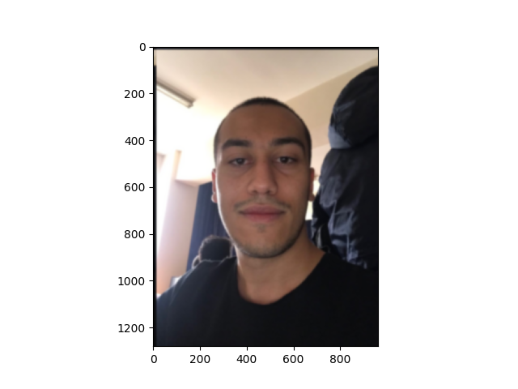

Simple image blur by convolution with a Gaussian kernel
-----

[_Jupyter Notebook_](./gaussian.ipynb)


Blur an an image (./elephant.png) using a _Gaussian_ kernel.

> Convolution is easy to perform with FFT: convolving two signals boils down to multiplying their FFTs (and performing an inverse FFT).


# Installation

**requires python 3.x**

```bash
pip install -r requirements.txt
```


# Running

```bash
python main.py
```

**Here's output:**


